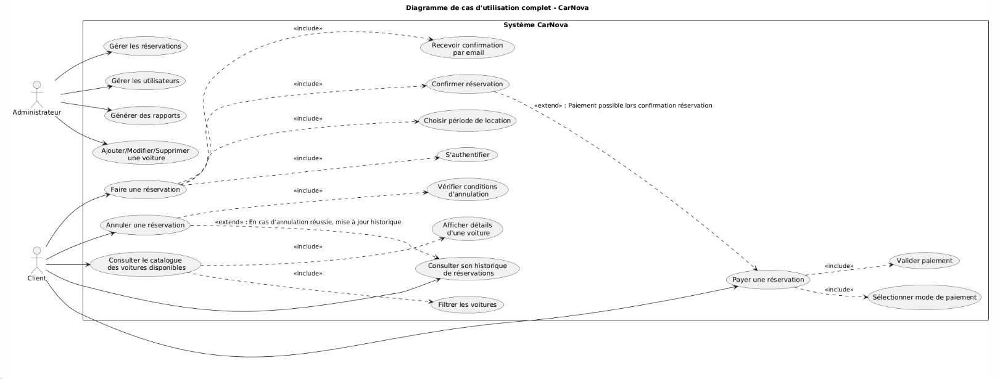
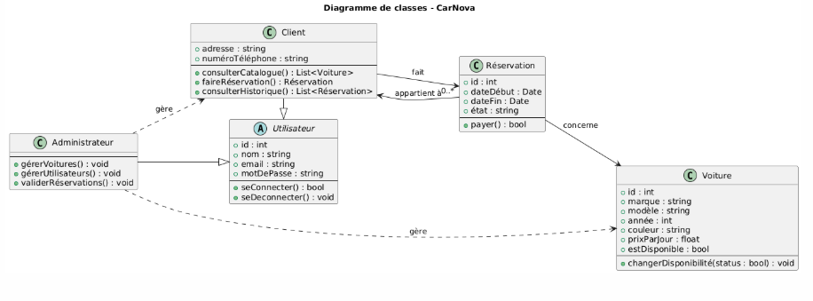

# CarNova – README

## Table des matières
- [Présentation du projet](#présentation-du-projet)
- [Problèmes à résoudre](#problèmes-à-résoudre)
- [Besoins exprimés](#besoins-exprimés)
- [Utilisateurs cibles et rôles](#utilisateurs-cibles-et-rôles)
- [Lien avec les technologies](#lien-avec-les-technologies)
- [Fonctionnalités](#fonctionnalités)
- [User Stories](#user-stories)
- [Priorisation des fonctionnalités](#priorisation-des-fonctionnalités)
- [Planification du projet](#planification-du-projet)
- [Outils nécessaires au développement](#outils-nécessaires-au-développement)
- [Contraintes techniques](#contraintes-techniques)
- [UML](#uml)
- [Mockup](#mockup)

---

## Présentation du projet

**Nom du projet : CarNova**  
**Description :** Plateforme web de **location de voitures** qui permet aux utilisateurs de réserver des véhicules rapidement selon leurs besoins.  
**Objectif principal :** Simplifier la location de voiture en ligne avec une expérience fluide, responsive et sécurisée.

---

## Problèmes à résoudre

- Manque de plateformes conviviales pour réserver une voiture facilement.
- Difficulté à visualiser rapidement les véhicules disponibles.
- Gestion manuelle des réservations pour les entreprises de location.

---

## Besoins exprimés

- Plateforme intuitive pour réserver une voiture.
- Affichage clair des disponibilités, prix et détails des véhicules.
- Espace d'administration pour gérer le parc automobile et les réservations.

---

## Utilisateurs cibles et rôles

| Type d'utilisateur     | Description                      | Rôles et permissions |
|------------------------|----------------------------------|----------------------|
| Visiteur               | Non connecté                     | - Consulter les offres disponibles - Accéder aux infos générales |
| Utilisateur inscrit    | Client avec compte               | - Réserver un véhicule - Consulter l’historique des réservations |
| Administrateur         | Gérant du site                   | - Ajouter/modifier/supprimer des véhicules - Gérer les réservations - Gérer les comptes utilisateurs |

---

## Lien avec les technologies

- **Laravel (Back-end)** : Authentification, gestion des réservations, rôles utilisateurs.
- **React (Front-end)** : Interface dynamique et responsive.
- **MySQL** : Stockage des données.
- **Tailwind CSS** : Style moderne et responsive.
- **GitHub** : Versioning et hébergement du code.

---

## Fonctionnalités

### Utilisateur simple
- Inscription / Connexion
- Navigation dans le catalogue de voitures
- Recherche filtrée (modèle, type, prix…)
- Réservation d’un véhicule
- Consultation de l’historique des réservations

### Administrateur
- Tableau de bord de gestion
- Ajout / modification / suppression de véhicules
- Consultation et suppression des réservations
- Gestion des comptes utilisateurs

---

## User Stories

### Pour l’utilisateur
- En tant qu'utilisateur, je veux créer un compte pour accéder aux services.
- En tant qu'utilisateur, je veux réserver une voiture depuis un catalogue.
- En tant qu'utilisateur, je veux voir les détails des voitures avant réservation.
- En tant qu'utilisateur, je veux consulter mes anciennes réservations.

### Pour l’administrateur
- En tant qu’admin, je veux ajouter un nouveau véhicule au catalogue.
- En tant qu’admin, je veux supprimer une réservation en cas de problème.
- En tant qu’admin, je veux gérer les comptes utilisateurs.

---

## Priorisation des fonctionnalités

| Fonctionnalité                 | Priorité |
|-------------------------------|----------|
| Inscription / Connexion       | 🟢 Essentielle |
| Réservation de véhicules      | 🟢 Essentielle |
| Gestion de véhicules (Admin)  | 🟢 Essentielle |
| Filtres de recherche          | 🟡 Moyenne |
| Historique utilisateur        | 🟡 Moyenne |
| Statistiques (Admin)          | 🟠 Bonus |

---

## Planification du projet

### Liste des tâches

**Phase 1 – Conception (3 jours)**
- Réalisation des maquettes (Figma)
- Conception des diagrammes UML
- Définition de l’architecture technique

**Phase 2 – Développement Back-End (5 jours)**
- Initialisation Laravel
- Authentification / Middleware
- Modèles & contrôleurs (voitures, utilisateurs, réservations)
- API REST sécurisée

**Phase 3 – Développement Front-End (5 jours)**
- Initialisation React avec Vite
- Pages : Accueil, Connexion, Catalogue, Réservation
- Connexion API + affichage conditionnel (utilisateur/admin)

**Phase 4 – Tests & Déploiement (3 jours)**
- Tests fonctionnels et sécurité
- Déploiement sur Hostinger
- Vérification responsive + UX

---

## Outils nécessaires au développement

| Type                    | Outils                           |
|-------------------------|----------------------------------|
| Back-End                | PHP, Laravel                     |
| Front-End               | JavaScript, React, Vite          |
| Base de données         | MySQL                            |
| IDE                     | Visual Studio Code               |
| Serveur local           | XAMPP                            |
| Outils de design        | Figma, StarUML                   |
| Contrôle de version     | Git, GitHub                      |
| Framework CSS           | Tailwind CSS                     |
| Icônes                  | Lucide Icons / FontAwesome       |

---

## Contraintes techniques

- Sécurité des API avec middleware Laravel
- Authentification JWT ou session classique
- Affichage responsive sur tous les écrans
- Bonne séparation front / back avec

## UML
- *Use Case Diagram* :

- *Class Diagram* :
